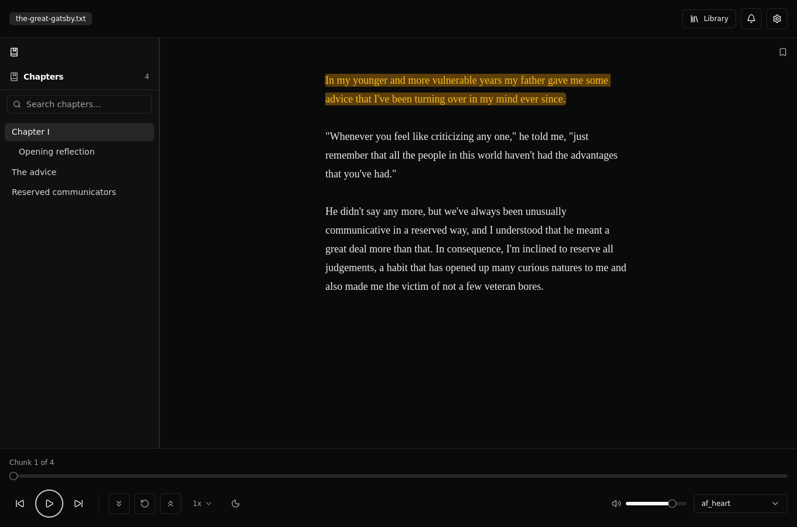
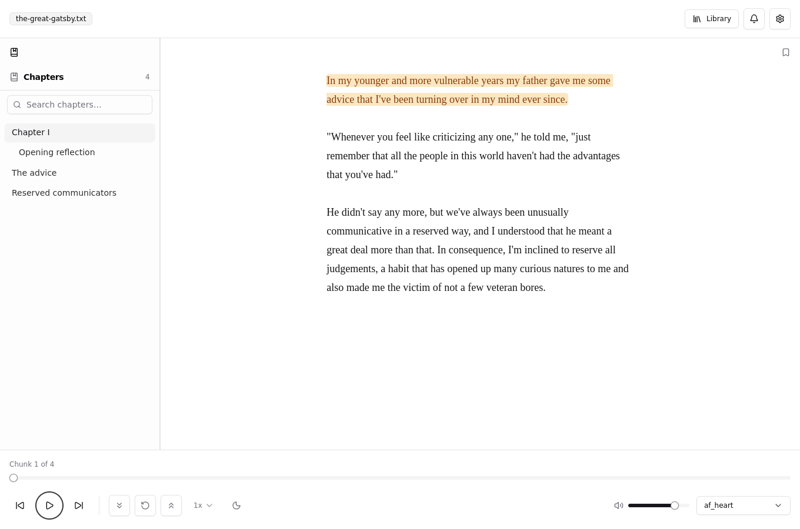
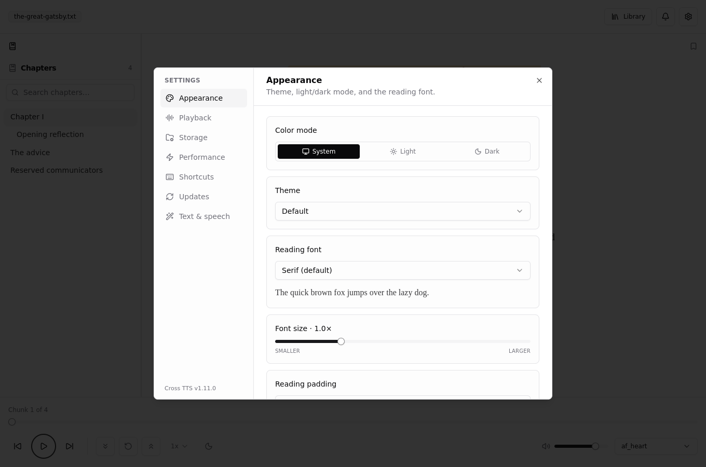

<div align="center">

# Cross TTS

**Turn any book into an audiobook — natural neural voices, fully offline, free.**

[](https://github.com/Emad-K/cross-tts/releases/latest)
[](https://github.com/Emad-K/cross-tts/releases)


Open an EPUB or text file, press play, and listen. Cross TTS reads your books aloud in a natural neural voice — **no account, no subscription, and no internet** once it's set up. The voice runs on your own computer, so nothing you read is ever uploaded anywhere.

[**⬇ Download for Windows · macOS · Linux**](https://github.com/Emad-K/cross-tts/releases/latest)



</div>

## 🎬 Demo

<!--
  Add a real demo VIDEO here so people can hear the voice (a GIF can't carry audio):
  1. Record a ~20–40s clip — open a book, hit play, show the highlight following along.
     Capture WITH system audio so the Kokoro voice is in the clip. (OBS, ShareX, or
     macOS Cmd-Shift-5 all work; export MP4, keep it under 100 MB.)
  2. Edit this README on github.com (the ✏️ button), then drag the .mp4 into the editor.
     GitHub uploads it and drops in a player URL like
     https://github.com/user-attachments/assets/<id> — commit, done.
  A silent GIF of the UI flow is a fine secondary option; put it in docs/media/ and
  reference it as .
-->

> ▶️ _Demo video coming soon — drag an `.mp4` in here on github.com to embed a player with sound._

## Get started in 30 seconds

1. **Download & install** the build for your system from the [releases page](https://github.com/Emad-K/cross-tts/releases/latest).
2. **Open a book** — any `.epub` or `.txt`. (No book handy? Hit **Try sample**.)
3. **Press play.** The first time, it downloads the voice once (a few seconds); after that everything works offline.

## What you can do with it

- 🎧 **Listen to any book in a natural voice.** 28 built-in voices, male and female. Pick the one you like and it reads — chapter after chapter, hands-free.
- ✨ **Follow along as it reads.** The current sentence is highlighted while it's spoken, so it's easy to read *and* listen, or glance up and find your place.
- 🔖 **Always pick up where you left off.** Your books live in a library with covers and progress; reopen one and it resumes at the exact spot — playback position, chapter, and all.
- 💾 **Make a real audiobook file.** Export a whole book to **M4B** (with chapters and cover art) or **MP3** and play it on your phone, car, or any audiobook app.
- 😴 **Sleep timer.** Drift off to a chapter — stop after a set time or at the end of the current chapter.
- ⏩ **Read at your pace.** Speed from 0.75× to 2×, plus an adjustable pause between sentences for a more natural rhythm.
- ⌨️ **Control it like a music player.** Play/pause and skip with your keyboard's media keys or headphones, even when the window is in the background.
- 📖 **Comfortable to read.** Light/dark modes, five themes, adjustable font size and spacing, and an **OpenDyslexic** font option.
- 🔒 **Private by design.** The voice is generated on your machine. No sign-up, no cloud, no tracking of what you read.
- 🗂️ **Watched folders & custom pronunciations** for power users — auto-import new books from a folder, and teach it how to say tricky names (including an optional pinyin pack for Chinese xianxia/wuxia terms).

## Screenshots

| Reading with read-along | Settings |
|---|---|
|  |  |

## Download & install

Grab the file for your system from the [latest release](https://github.com/Emad-K/cross-tts/releases/latest):

| System | File |
|---|---|
| **Windows** | `…-setup-x64.exe` (installer) or `…-portable-x64.exe` (no install) |
| **macOS** | `…-arm64.dmg` (Apple Silicon — M1/M2/M3) or `…-x64.dmg` (Intel) |
| **Linux** | `…-x86_64.AppImage`, `.deb`, or `.rpm` (also `arm64` builds) |

Updates arrive automatically inside the app.

> **macOS / Windows note:** the app isn't code-signed yet, so the first launch may show a "unidentified developer" or SmartScreen warning. On macOS: right-click the app → **Open**. On Windows: **More info → Run anyway**.

## System requirements

Cross TTS generates the voice **on your computer**, so playback is as smooth as your hardware. The good news: the voice model (Kokoro-82M) is small and the app renders the next sentences ahead of time, so most machines play with no lag.

**For a lag-free experience:**

- **Best (instant, never waits):** any computer with a graphics card the app can use for acceleration — this is **on by default** and covers most laptops and desktops from roughly the last 6 years, including **Apple Silicon Macs** and built-in Intel/AMD graphics.
- **No supported GPU? Still smooth on CPU:** a modern **4-core (or better) processor** generates speech faster than you listen, so playback keeps up. Older or 2-core machines may pause for a second before the very first sentence, then run fine.
- **Memory:** 4 GB RAM minimum, 8 GB comfortable.
- **Disk:** roughly a few hundred MB — the app plus the voice files, downloaded once and cached.
- **OS:** Windows 10/11, macOS 11+, or a current 64-bit Linux desktop.
- **Internet:** only for the one-time voice download and app updates. Reading and listening are **100% offline** after that.

Synthesis settings (use GPU, CPU thread count) live in **Settings → Performance** if you want to tune them.

---

## License

MIT © Emad Kazemi — see [LICENSE](LICENSE).

---

<details>
<summary><strong>For developers</strong></summary>

Built with Electron, React, TypeScript, Tailwind, and Vite (electron-vite). TTS is [kokoro-js](https://github.com/hexgrad/kokoro) (`onnx-community/Kokoro-82M-v1.0-ONNX`) running on ONNX Runtime in a Web Worker — WebGPU when available, CPU (wasm) otherwise.

```bash
pnpm install
pnpm run dev        # hot-reload dev app
pnpm run typecheck  # tsc --noEmit
pnpm run test       # unit tests (bun test)
pnpm run test:e2e   # Playwright smoke tests against the built app
pnpm run build      # production build
pnpm run dist       # package installers (or dist:win / dist:mac / dist:linux)
```

### Project layout

```
src/
├── bun/        # Electron main process (file I/O, model cache, updates, IPC)
├── preload/    # context-isolated IPC bridge
├── mainview/   # React renderer (reader, library, playback, settings)
└── shared/     # pure logic shared across processes (unit-tested with bun)
e2e/            # Playwright tests against the packaged app
docs/media/     # README screenshots (regenerate: node e2e/capture-screenshots.mjs)
```

### Releasing

Releases are driven by `package.json` — **bump the version in a PR and merge it.** When a push to `main` carries a version with no matching `v<version>` tag, the **Release** workflow builds all three OSes, creates the tag, and publishes the GitHub Release. Pushes that don't change the version are a no-op.

```bash
pnpm version minor   # or patch / major
# open a PR, merge to main → Release publishes v<new-version>
```

`workflow_dispatch` re-runs a release for the current version.

### Contributing

Issues and PRs welcome. CI runs typecheck, unit tests, a three-OS build, and Playwright smoke tests on every PR — `pnpm run build:check && pnpm run test` locally gets you most of the way.

</details>
